# Guia de Implementação (localhost)
Um guia passo-a-passo para a instalação das ferramentas necessárias e resolução de possíveis problemas ao iniciar um projeto do tipo "webapp" pelo Apache NetBeans, utilizando o servidor Apache Tomcat

## Instalação do Apache NetBeans

A primeira etapa para iniciar a colaboração neste projeto é a instalação da IDE Apache NetBeans.  
Link do site oficial com as versões para a instalação: (https://netbeans.apache.org/front/main/download/).  
É recomendada a instalação da última versão da IDE, para evitar quaisquer conflitos entre versões.  

Caso ainda não tenha instalado nenhuma versão do JDK em sua máquina, será exigida a instalação para rodar a IDE.  
Link do site oficial para instalação da última versão do JDK: (https://www.oracle.com/br/java/technologies/downloads/).  
Após a instalação, a IDE deverá abrir normalmente.  

## Instalação do Apache Tomcat

Para instalar o Apache Tomcat, basta utilizar o link (https://tomcat.apache.org/download-11.cgi) e baixá-lo como serviço, acessando a área "Binary Distributions", "Core" e "Windows Service Installer" conforme a imagem abaixo:  

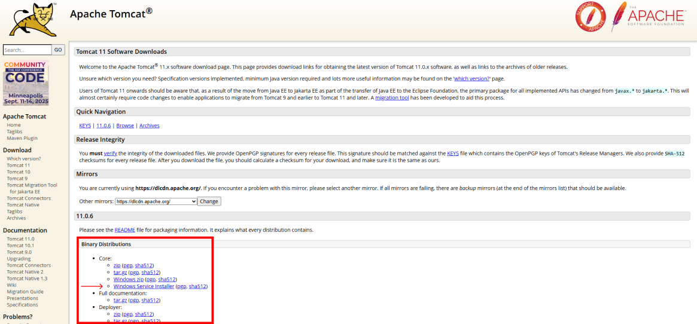  

Após ter sido concluído o download do arquivo, basta seguir o fluxo padrão de instalação do Tomcat:  

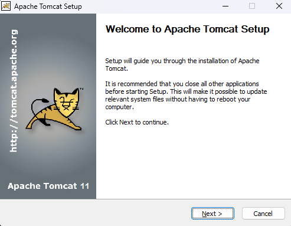
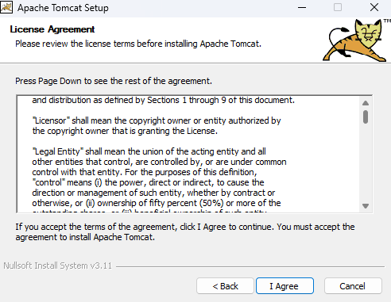
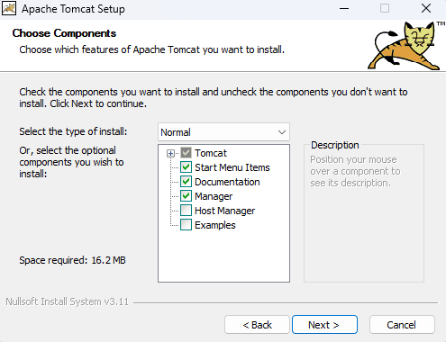  

É importante certificar-se de que, na etapa seguinte, você adicione o papel "manager-script" aos papéis do administrador (ou roles, em inglês), além de escolher um nome e senha para utilizarmos posteriormente. Dessa forma o Apache NetBeans terá o acesso necessário para rodar a aplicação web no localhost.  

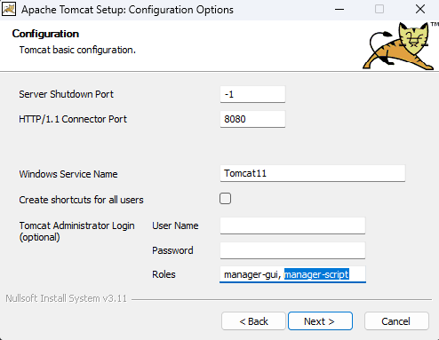
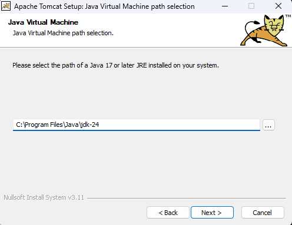
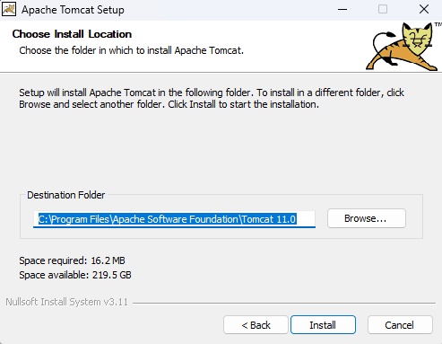  

## Criação do Webapp no Apache NetBeans

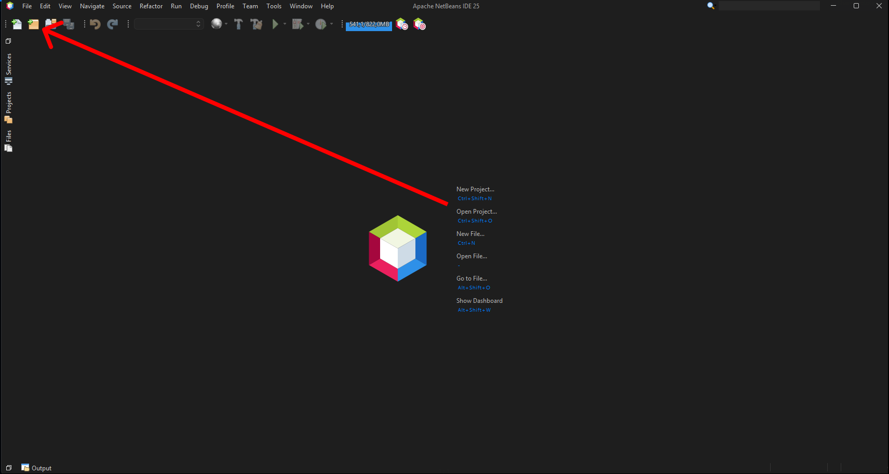
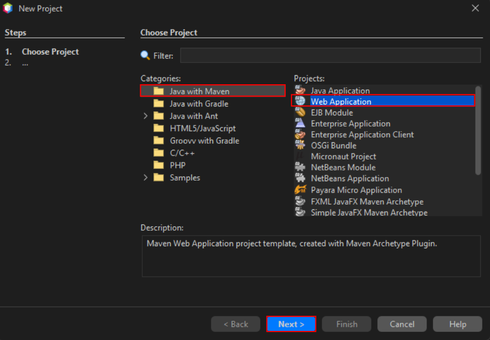
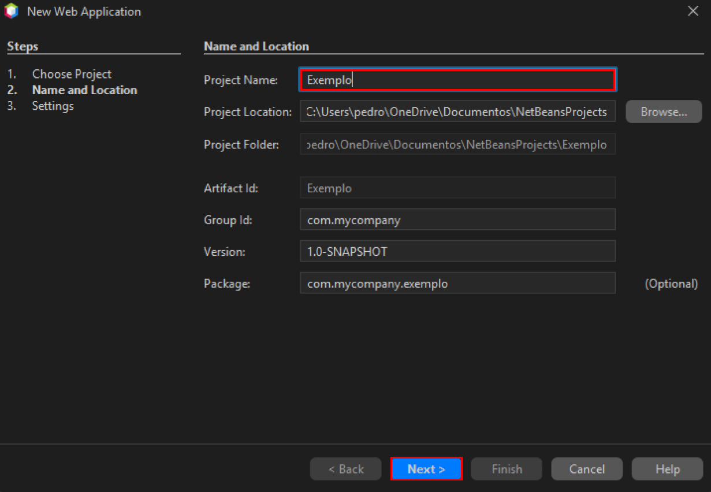
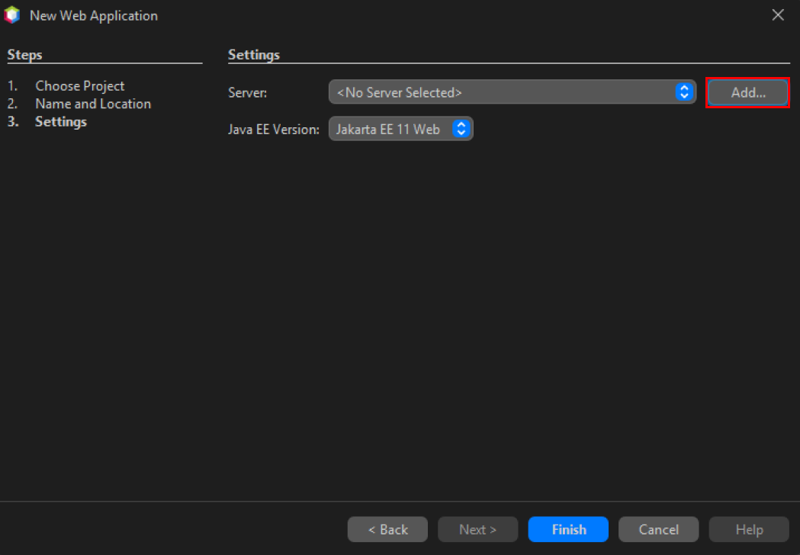
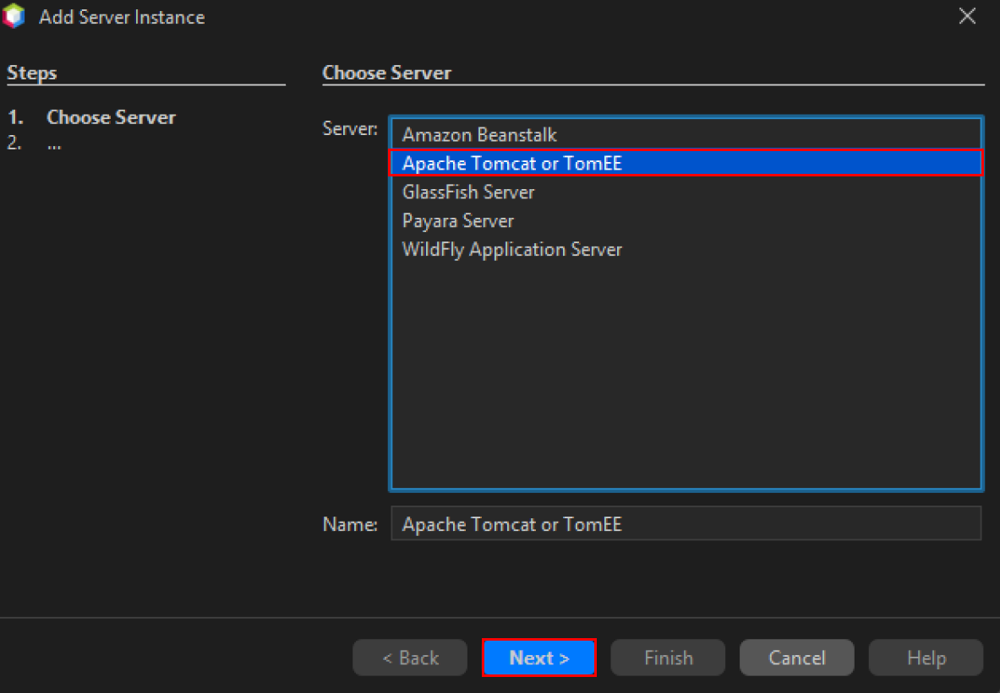
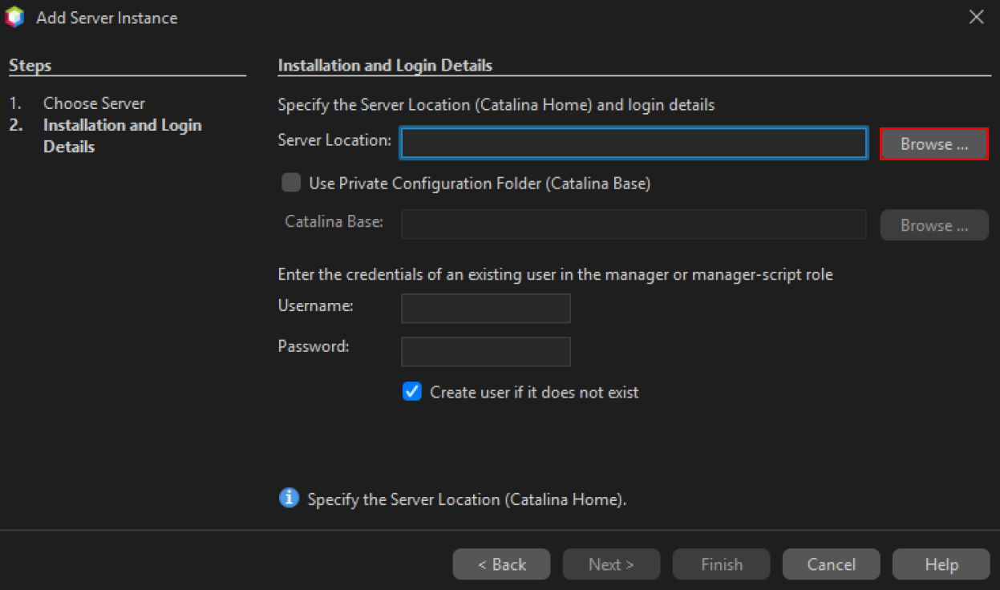

Local de instalação padrão do Tomcat: C:\Program Files\Apache Software Foundation

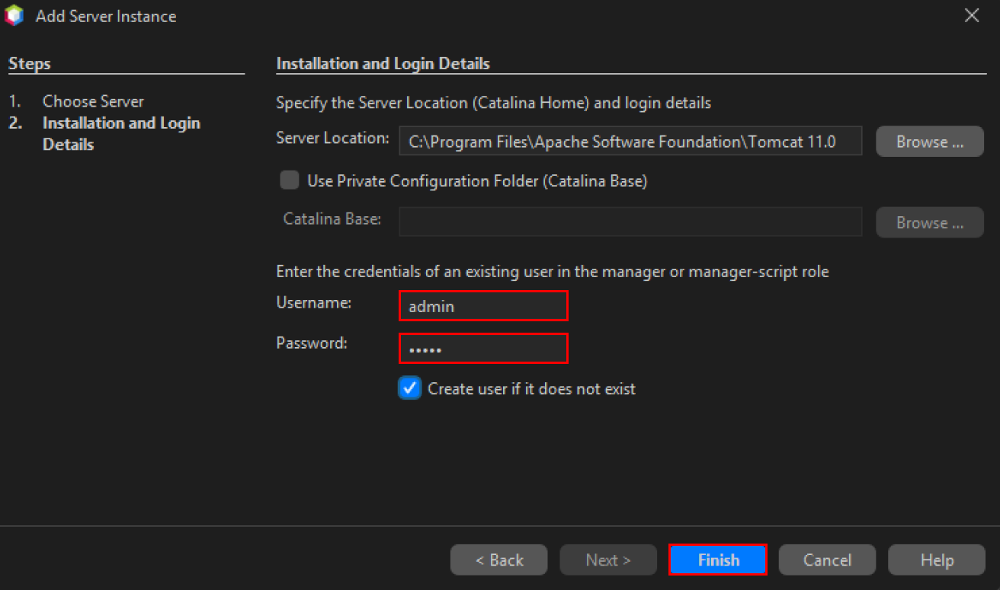
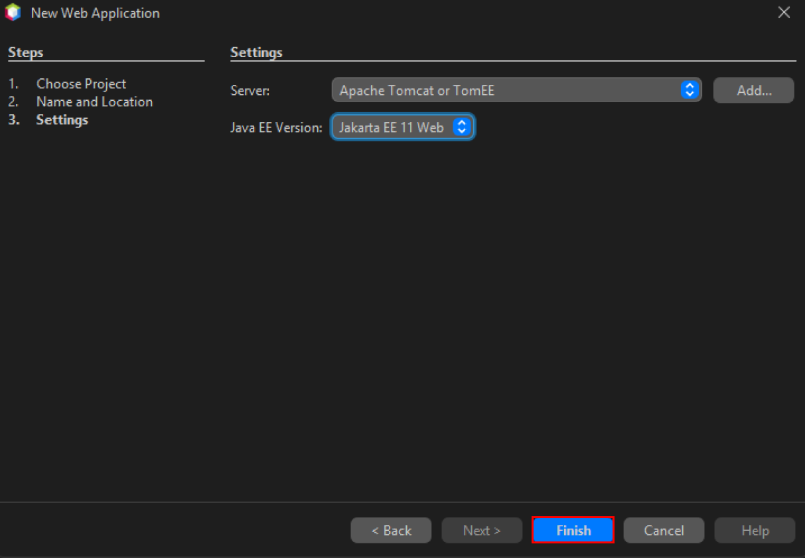  

Ao fim desse processo, uma estrutura de diretórios como a mostrada a seguir será criada:

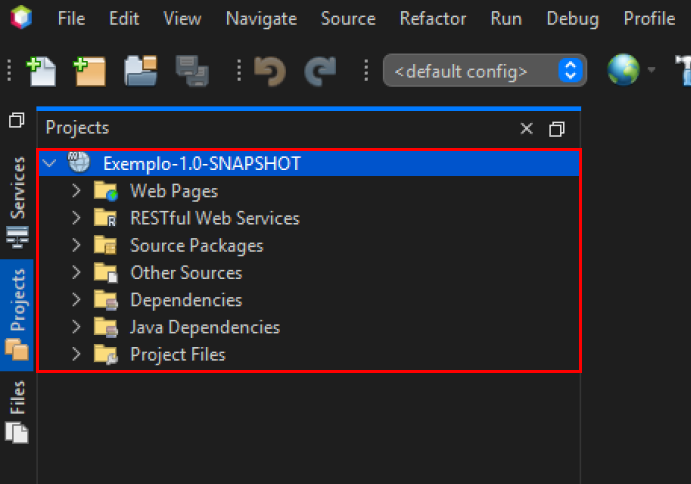

Basta, então, que você execute o projeto para que ele seja compilado e comece a rodar no localhost (localhost:8080/NomeDoProjeto).

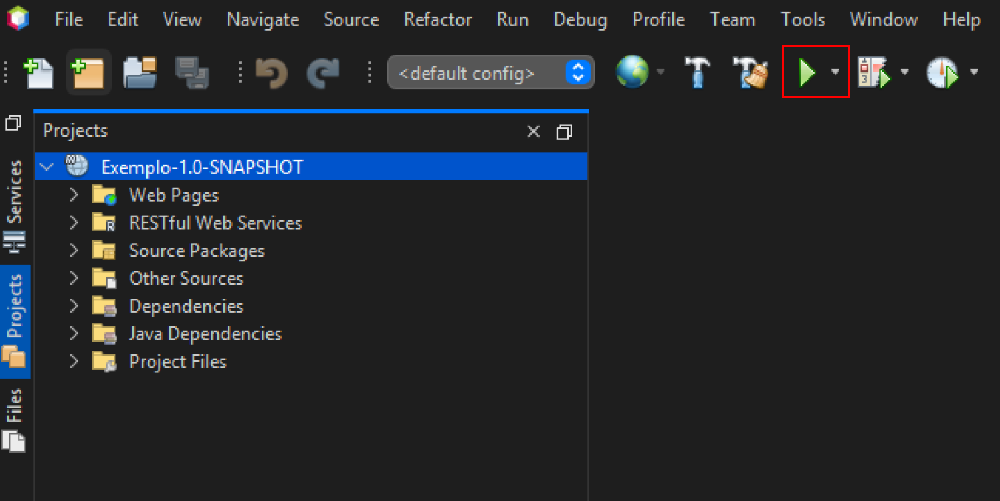

## Problemas Conhecidos

As próximas etapas deste guia servem para contornar alguns dos problemas enfrentados ao iniciar a aplicação web diretamente do Apache NetBeans.

### Permissão de Acesso para o Diretório do Tomcat

Ao criar um projeto do tipo webapp no Apache NetBeans, é provável que a IDE lhe informe que o caminho do arquivo do servidor é inválido e isso é um problema causado pela falta de acesso da IDE com o Tomcat.  

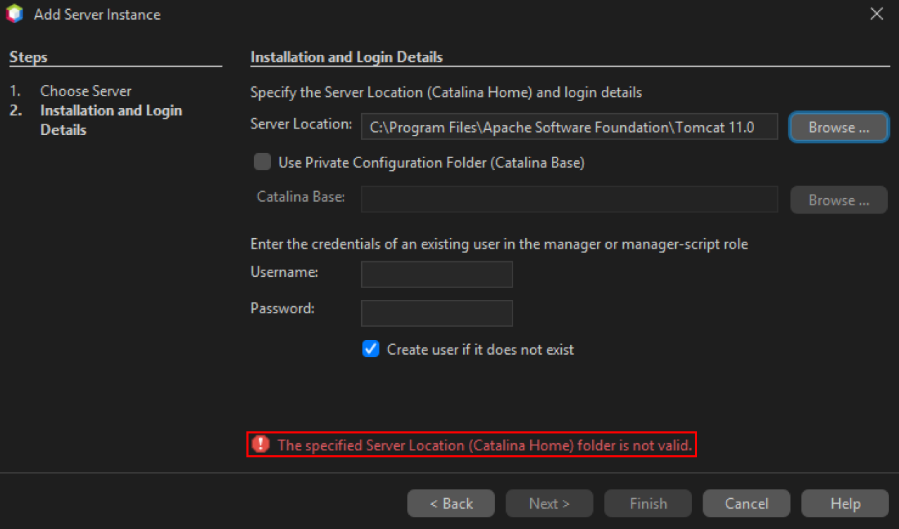

Para contornar esse problema, pode ser acessado o diretório do Tomcat através do explorador de arquivos para que o sistema solicite a permissão de administrador.

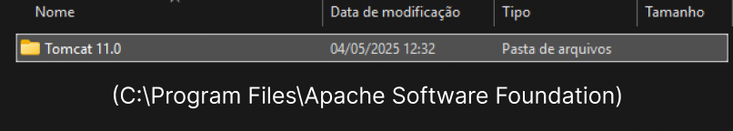
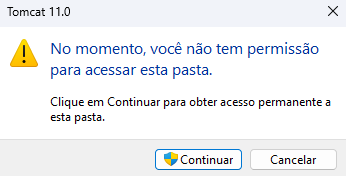

Após essa alteração, basta fechar a janela de seleção do diretório do servidor e tentar novamente:  

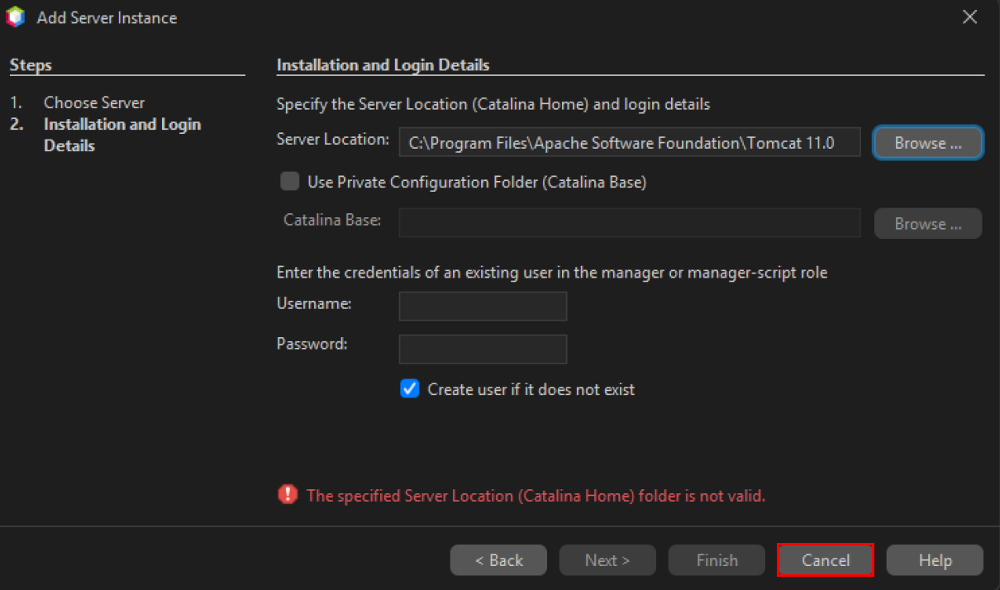

### Deploy com o Servidor em Funcionamento

Caso o servidor Tomcat esteja em funcionamento ao tentar dar deploy no projeto, é provável que receba a mensagem de erro "FALHA - Incapaz de criar o diretório [C:\Program Files\Apache Software Foundation\Tomcat 11.0\conf\Catalina\localhost]".  
Se isso acontecer, uma possível solução é parar a execução do servidor e rodar o webapp diretamente da IDE, sem antes iniciar o servidor.

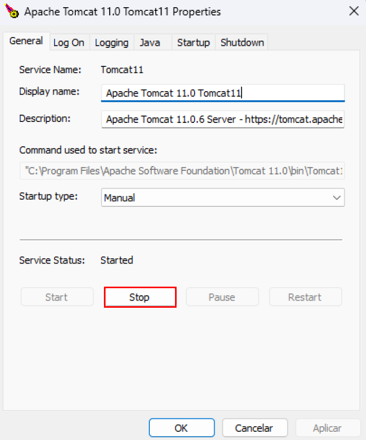

